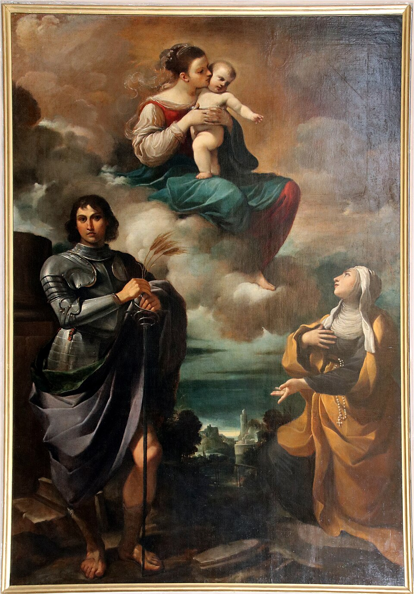
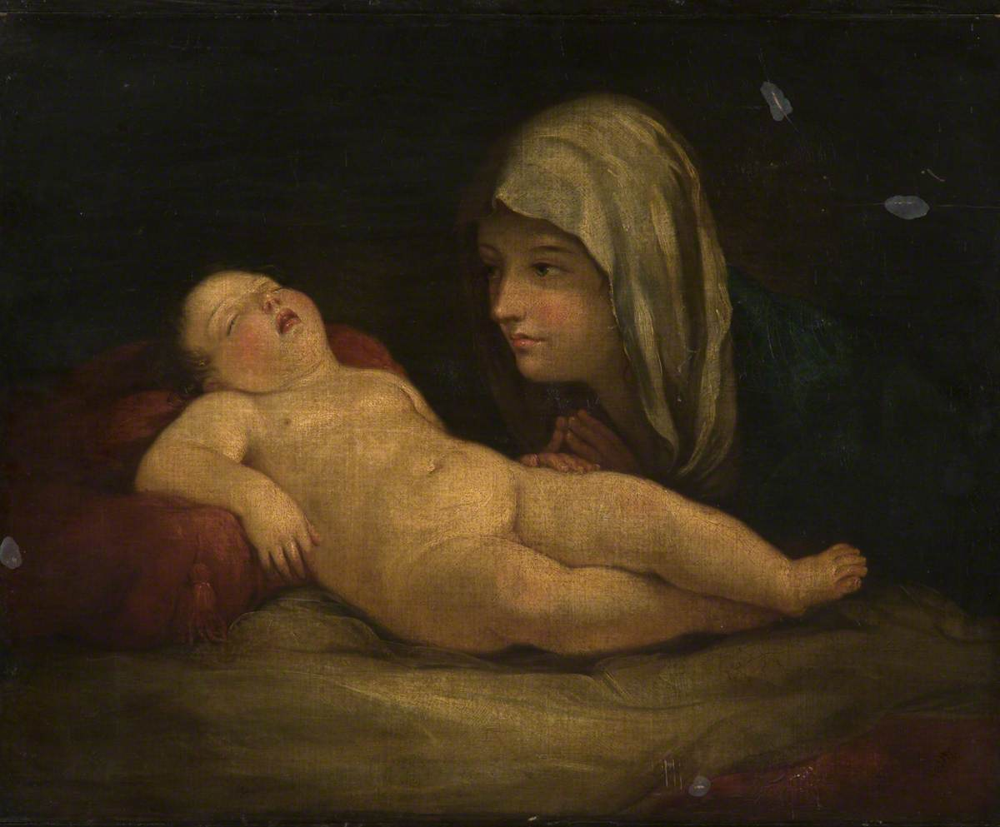

<h1 class="title">Augmenting Cultural Heritage Data</h1>

Combining SPARQL and LLMs to expand The Bolognese School (Guercino’s and Guido Reni’s paintings Wikidata profiles)

  <a href="index.md">HOME</a>
  <a href="wikidata.md">WIKIDATA</a>
  <a href="sparql.md">SPARQL QUERIES</a>
  <a href="llm.md">LLM PROMPTS</a>
  <a href="rdf.md">RDF TRIPLES</a>

## About the Project

Our cultural heritage project focuses on enriching **Wikidata** entries related to the **Bolognese School**, particularly the works of **Guercino** and **Guido Reni**.

---

## Methodology

  

    
    
<b>Guercino</b> (Q334262) <i>Madonna col Bambino...</i>

  

  

    
    
<b>Guido Reni</b> (Q109061) <i>The Madonna and Sleeping Child</i>

  

1. We investigated the **Wikidata** knowledge base...  
2. Using **SPARQL**, we identified missing data...  
3. To fill these gaps, we integrated **LLMs**...  
4. We created **RDF triples**...

---

## Conclusion

This project illustrates how **AI-powered inference**, **SPARQL**, and **human validation** can enhance open cultural knowledge.

---

## Team

- Saida Tynyshbek  
- Gaukhar Serikbay  
- Ekaterina Berezina  
- Dinara Khassenova
